# Documentação de git-flow - RSC.

Esse documento pretende estabelecer um passo-a-passo comum à ser seguido por todos os desenvolvedores para que possamos minimizar os problemas de conflitos de merge, “lock” nas branches nos ambientes e etc…
Será simulado o processo completo de alguém que irá desenvolver uma feature (inovação/sustentação) dentro de um repositório já existente, já que esse é o cenário mais comum.


# Entendendo as branches.

Foi definido que em um cenário comum, o repositório de um projeto terá 3 branches principais (variações poderão ocorrer de acordo com a necessidade ou limitações do projeto):
 - **Master**: essa branch se destina somente à versão do projeto que está em produção, já tendo passado pelo desenvolvimento, Q.A e Homologação do cliente.
 - **Homolog**: nesta branch, estará a versão que está sendo homologada pelo cliente, ou seja, última etapa antes de ir para produção.
 - **Development**: aqui estará a versão mais recente do projeto, com todas as features recém desenvolvidas que ainda estão passando pelos testes de Q.A. Ou seja, aqui estarão as features que o cliente solicitou, mas que ainda não estão disponível para homologação.

 Porém, lembre-se de que **não se deve realizar alterações diretamente nestas branches**, salvo em casos de **urgência** e com a **aprovação** do gestor. Para o desenvolvimento de manutenções e novas features, deverá ser criada novas branches, baseadas na branch **‘homolog’**, com o código da ficha do **Azure** que se referem a aquele desenvolvimento, para a realização do merge posteriormente, como será demonstrado a seguir.


## Passo-a-passo do processo de desenvolvimento.

Para a demonstração do fluxo do processo de desenvolvimento, vamos tomar como exemplo o projeto fictício **‘XXX-dddd’** . Este projeto possui um único arquivo **‘index.js’**, e ainda não possui versão em produção (Caso deseje criar o estado inicial do repositório para seguir os exemplos deste documento, execute o passo a passo descrito no Apêndice A).

O estado inicial do projeto, por tanto, encontra-se da seguinte forma:

  - Branch master: **vazia**
  - Arquivo **index.js** na branch **homolog** (versão sendo atualmente homologada pelo cliente): <br>

  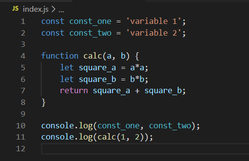

  - Arquivo index.js na branch **development** (versão sendo atualmente testada pelo Q.A): <br>

  


## Iniciando o desenvolvimento de uma nova demanda.

Você, como desenvolvedor, acaba de receber uma nova demanda de manutenção solicitada pelo cliente. A história no azure possui o código XXX-dddd-001. Partindo do pressuposto que o repositório do projeto encontra-se em seu computador, com as 3 branches principais **(master, homolog e development)** atualizadas, você está pronto para iniciar o fluxo de desenvolvimento (Caso ainda não possua o repositório do projeto clonado em seu computador, consulte o passo 3 do Apêndice A. Caso possua o repositório clonado, mas as branches principais estejam desatualizadas, consulte o Apêndice B para mais informações de como atualizar uma branche local).

Dentro da pasta raiz do repositório local, certifique-se de que você está dentro da branch homolog com o comando ‘git status’. Caso não esteja, rode o comando ‘git checkout homolog’ para navegar até a branch homolog.<br>

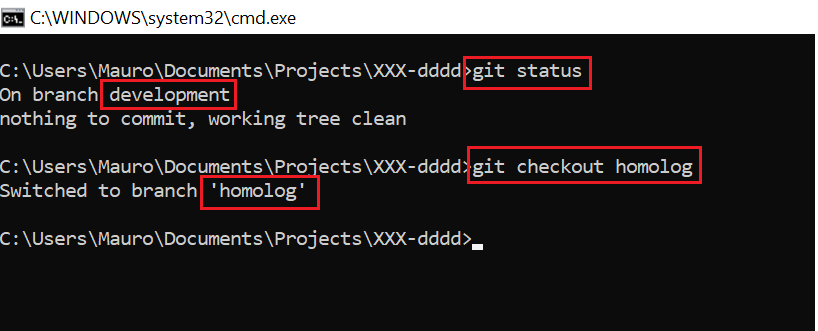

Dentro da branch homolog, crie uma nova branch com o código da ficha do azure com o comando **‘git checkout -b XXX-dddd-001’**. <br>


**Lembre-se**: Em uma situação normal, sempre faremos o desenvolvimento de uma manutenção ou nova feature baseada na branch homolog, pois a branch master tende a ser muito defasada em relação a homolog, e a branch development tende a ser muito instável uma vez que outras features estão sendo testadas pelo Q.A e pode sofrer mudanças com uma alta frequência. Além disso, utilizamos o código da ficha do azure como nome da branch para fins de rastreabilidade e auditoria. 


## Aplicando as correções necessárias.

Certifique-se de estar dentro da branch XXX-dddd-001 com o comando **‘git status’**. Abra o seu editor de código e inicie a correção solicitada, realizando todos os testes necessários de forma local. Para exemplificar, considere que foram realizadas as seguintes alterações no arquivo index.js:


Quando as modificações necessárias para a manutenção forem concluídas, é hora de fazer o commit. **Lembre-se**: evite de acumular muitas alterações em um único commit pois isso dificulta a rastreabilidade das alterações do projeto.

Ainda dentro da branch XXX-dddd-001, rode o comando **‘git status’** e note que os arquivos com alterações pendentes de commit serão listados:

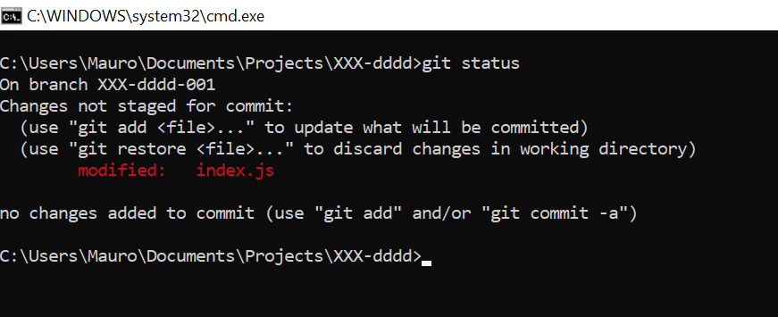

Para confirmar as alterações, rode o comando **‘git add .’** (note que o ponto faz parte do comando. Ele indica que deverá ser adicionado todos os arquivos modificados). Para confirmar que o comando anterior funcionou, rode novamente o comando o **‘git status’**.

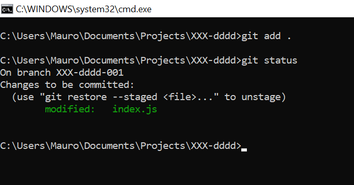

 Por fim, realize o commit da modificação realizada com o comando **‘git commit -m “<comentário_da_alteração>”’**, seguido da atualização do repositório remoto com **‘git push origin XXX-dddd-001’**.

 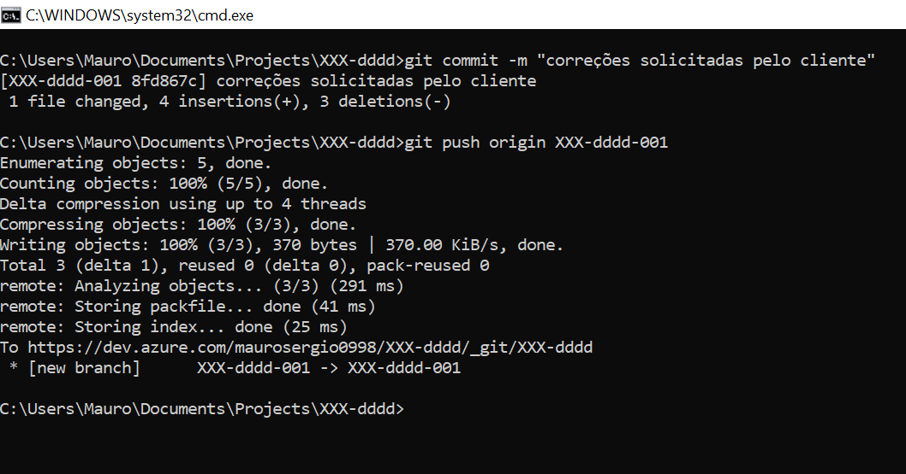


## Disponibilizando as alterações para testes do Q.A.

Uma vez tendo finalizado as modificações necessárias, é hora de disponibilizar suas correções para o ambiente de teste do Q.A, ou seja, passar as alterações realizadas para a branch ‘development’. Realize a seguinte sequência de passos:

- Atualize a sua branch XXX-dddd-001 com os commits da branch homolog. Assim, caso a branch homolog tenha sido atualizada por outro desenvolvedor durante o seu desenvolvimento, garantimos que todas as alterações já testadas pelo Q.A continuarão presentes. **Dentro da branch XXX-dddd-001** rode o comando **‘git pull origin homolog’**.

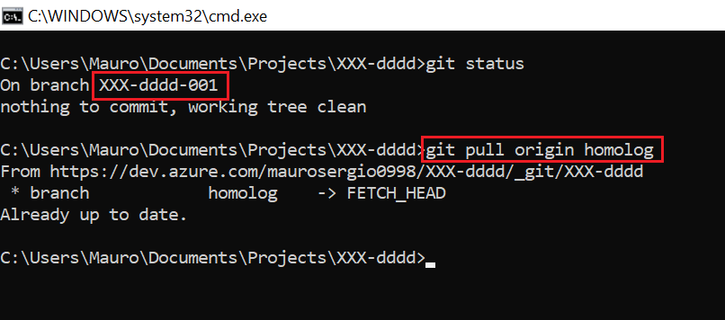

- Atualize a branch ‘development’ local com os commits da própria branch ‘development’ remota. Assim, garantimos que no momento do merge nenhum commit anterior ficará de fora. **Dentro da branch development**, rode o comando **‘git pull origin development’**.


- Por fim, ainda **dentro da branch ‘development’**, rode o comando **‘git merge XXX-dddd-001’**.

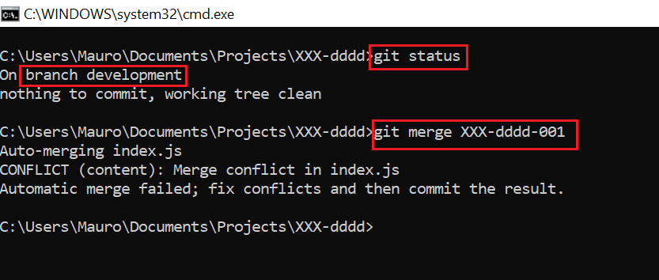

<h2><strong>AGORA, CUIDADO!</strong></h2> 
Veja que no nosso exemplo, há um conflito de merge que deverá ser analisado manualmente. Lembre-se que a branch development possui alterações que podem ainda não estar presente na branch homolog e, por isso, esses conflitos podem ocorrer. Neste caso, analise com muito cuidado e, se necessário, converse com os demais desenvolvedores. 

Veja qual é o conflito neste nosso exemplo:

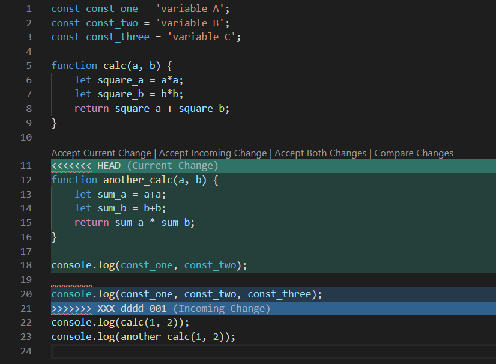

Analisando, descobrimos que há uma nova função no arquivo index.js, a another_calc, que ainda está sendo testada pelo Q.A, e por isso, ainda não estava disponível na branch homolog quando fizemos a última atualização. Neste caso, não podemos apagar esta função, ela deverá ser mantida no arquivo. Por tanto, após análise, o arquivo index.js deverá ficar da seguinte forma:

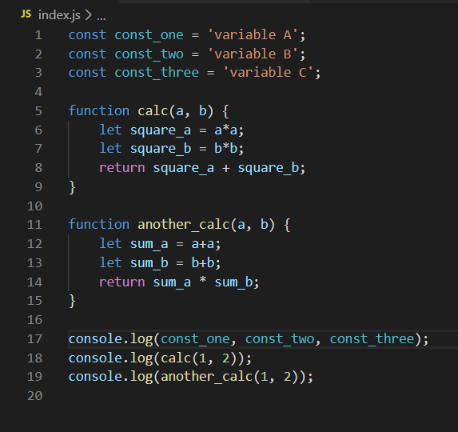

Caso um conflito de merge tenha ocorrido, após realizar a correção, siga os seguintes passos:

- Rode o comando **‘git add .’** para adicionar às mudanças e, em seguida, rode o comando **‘git commit -m “<comentário_do_conflito_resolvido>”’**.


- Atualize a branch development remota com o comando **‘git push origin development’**.

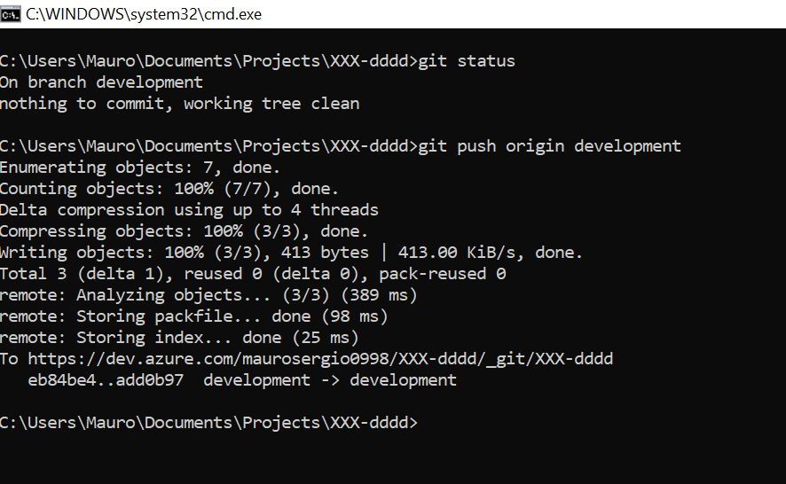

Note que, até aqui, tudo foi realizado em sua máquina local, pois devemos sempre evitar fazer acessos aos servidores para outras atividades que não seja deploy. Assim sendo, o último passo para enfim disponibilizar as alterações no ambiente de teste do Q.A, é atualizar o repositório local do servidor. Para isso, basta rodar o comando **‘git pull origin development’** de **dentro da própria branch development**, no prompt de comando do servidor onde o projeto está rodando para teste.


## Disponibilizando as alterações para Homologação do cliente.

Uma vez as alterações tendo sido testadas e aprovadas pelo Q.A, é hora de disponibilizar as alterações para o cliente testar, ou seja, realizar o merge com a branch homolog. Da mesma forma que anteriormente, vamos começar executando o processo em nossa máquina local antes de acessar o servidor. Siga os seguintes passos:

- Como antes, atualize a sua branch XXX-dddd-001 com a branch homolog remota. Rode o comando **‘git pull origin homolog’** de **dentro da branch XXX-dddd-001**.


- Em seguida, atualize a sua branch homolog local com a branch homolog remota. Rode o comando **‘git pull origin homolog’** de **dentro da branch homolog**.


- Por fim, **dentro da branch homolog**, rode o comando **‘git merge XXX-dddd-001’**.


**Lembre-se**: Sempre que um merge é realizado, conflitos podem acontecer como aconteceu na etapa anterior. Se isso ocorrer, reforçamos a necessidade de uma análise cuidadosa para que nenhuma correção anterior seja “matada” pela atual.

- Atualize o branch homolog remota com o comando **‘git push origin homolog’** de **dentro da branch homolog local**.


 Como na etapa anterior, agora basta entrar no servidor onde o projeto está rodando em homologação e, de **dentro da branch homolog**, rodar o comando **‘git pull origin homolog’**.


## Disponibilizando as alterações para Produção

Como última etapa, é realizado o merge da homolog com a master, para que aquilo que foi homologado e aprovado pelo cliente seja posto em produção. Neste caso, realizamos o merge diretamente com a homolog, uma vez que nesta etapa a solicitação parte do cliente após a finalização de seus próprios testes.

- Atualize sua branch master local com a branch master remota. Rode o comando **‘git pull origin master’** de **dentro da branch master**.

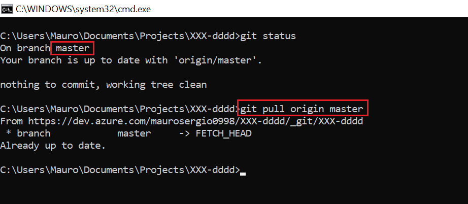

- Atualize a sua branch homolog local com a branch homolog remota. Rode o comando **‘git pull origin homolog’** de **dentro da branch homolog**.

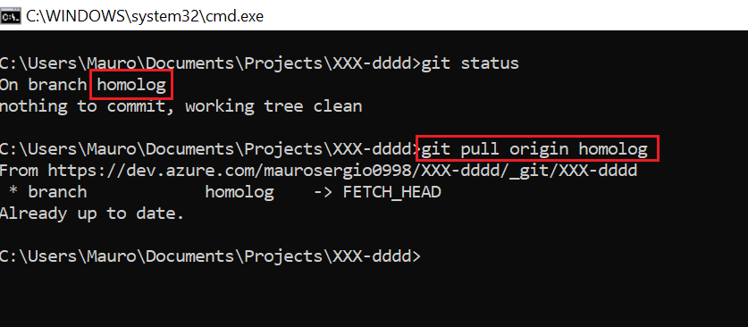

- Realize o merge com o comando **‘git merge homolog’** de **dentro da branch master**.


- Atualize a branch master remota com o comando **‘git push origin master’** de **dentro da branch master**.

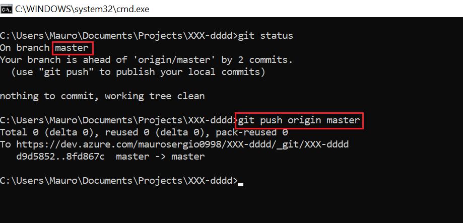

- No servidor de produção, atualize a branch master com o comando **‘git pull origin master’** de **dentro da branch master**.


## Apêndice A - Criando o estado inicial do projeto de exemplo.

- Em sua conta da Azure, crie o projeto **XXX-dddd**.

```imagem aqui```

- Inicialize o repositório Git do projeto da Azure:

```imagem aqui```

- Clone o repositório em sua máquina.

```imagem aqui```

- Agora, dentro da pasta do projeto em seu computador, **crie a branch homolog**.

```imagem aqui```

- Crie o arquivo index.js conforme exemplo:

```imagem aqui```

- Realize o processo de commit do novo arquivo como se segue:

```imagem aqui```

- Realize o push, para atualizar o repositório remoto com os novos commits:

```imagem aqui```

- Ainda na pasta do projeto, e ainda na branch homolog, crie uma nova branch chamada **‘development’**:

```imagem aqui```

- Modifique o arquivo index.js conforme exemplo:

```imagem aqui```

- Realize o commit do novo arquivo na branch development, seguido do push para atualização do repositório remoto:

```imagem aqui```

## Apêndice B - Atualizando uma branch local

Na pasta raíz do projeto em seu computador, e **dentro da branch que você deseja atualizar**, rode o comando **‘git pull origin <nome_da_branch>’**. Desta forma, a branch especificada em sua máquina será atualizada com os novos commits disponíveis do repositório remoto.
Por tanto, caso você deseje atualizar a branch homolog com os commits da própria branch homolog do repositório remoto, rode o comando ‘git pull origin homolog’ estando dentro da branch homolog em seu computador. Caso deseje atualizar uma branch x com os commits da branch homolog do repositório remoto, rode o comando **‘git pull origin homolog’** estando **dentro da branch x** em seu computador.


## Apêndice C - Diagrama do resumo do processo


